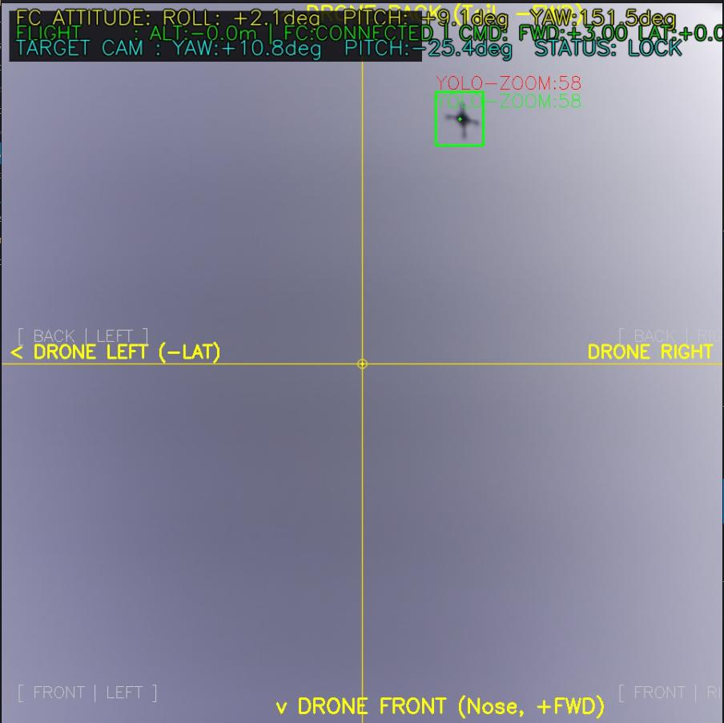

# 3D Euclidean Geometry: Target Drone from Camera Image

## 1. Objective
To determine the 3D position of a target drone from a single camera image using a standard YOLO $320 \times 320$ bounding box, factoring in the specific ultra-wide camera parameters and image cropping.

---

## Part A: Image Cropping and YOLO Pixel Conversion

### 2. Original Image Data
Based on the raw camera data and the image provided:
*   **Target Drone Physical Width ($W$)**: $0.35\text{ m}$
*   **Original Cropped Image Resolution**: $899 \times 901$ pixels
*   **Original Cropped Image Center ($c_x, c_y$)**: $(449.5, 450.5)$

Visual estimations of the target drone bounding box in the $899 \times 901$ image:
*   **Target Width ($w_{orig}$)**: $\approx 60$ pixels
*   **Target Center X ($u_{orig}$)**: $\approx 560$ pixels
*   **Target Center Y ($v_{orig}$)**: $\approx 150$ pixels

### 3. Converting to YOLO $320 \times 320$ Space
To run through YOLO, the $899 \times 901$ crop is scaled down to a $320 \times 320$ square.

**Scaling Factors:**
*   **Horizontal Scaling Factor ($S_x$)**: $320 / 899 \approx 0.35595$
*   **Vertical Scaling Factor ($S_y$)**: $320 / 901 \approx 0.35516$

**New YOLO Image Center ($c_{x\_new}, c_{y\_new}$):**
*   $(160, 160)$

**Transforming Bounding Box Pixels:**
Applying the scaling factors to the original bounding box measurements:
*   **New Target Width ($w_{px}$)**: $60 \times 0.35595 = \mathbf{21.36 \text{ pixels}}$
*   **New Target Center X ($u_t$)**: $560 \times 0.35595 = \mathbf{199.33 \text{ pixels}}$
*   **New Target Center Y ($v_t$)**: $150 \times 0.35516 = \mathbf{53.27 \text{ pixels}}$

---

## Part B: Camera Parameters and 3D Depth

### 4. Camera Specifications
We are using the **SainSmart Raspberry Pi Camera Module 3 (Ultra Wide)**:
*   **Sensor**: 12MP Sony IMX708
*   **Native Sensor Resolution**: $4608 \times 2592$ pixels
*   **Diagonal Field of View (FOV)**: $152^\circ$

### 5. Calculating Focal Lengths (in Pixels)
To perform Euclidean geometry, we need the focal length in pixels. Because the 899 x 901 image was a direct crop from the native 4608 x 2592 image, **the crop retains the same pixel focal length as the native sensor**.

**Native Focal Length (Pinhole Approximation):**
* Diagonal in pixels: D_px = sqrt(4608^2 + 2592^2) ≈ 5287 px
* `f_native = D_px / (2 * tan(152° / 2))`
* `f_native = 5287 / (2 * 4.01) ≈ 659 pixels`

**Scaling Focal Length to YOLO 320 x 320:**
Since we scale the 899 x 901 cropped image down to 320 x 320, the focal length must shrink by the exact same proportion (S_x).
* `f_yolo = f_native * S_x`
* `f_yolo = 659 * 0.35595 ≈ 234.57 pixels`

### 6. Final Euclidean Calculations
Using the YOLO 320 x 320 data, we calculate the exact 3D coordinates of the target drone relative to the camera lens.

**Depth / Distance (Z):**
* `Z = (f_yolo * W_target) / w_px`
* `Z = (234.57 * 0.35) / 21.36 ≈ 3.84 meters`

**Horizontal Position (X):**
* `X = ((u_t - c_x) * Z) / f_yolo`
* `X = ((199.33 - 160) * 3.84) / 234.57 ≈ 0.64 meters (Right)`

**Vertical Position (Y):**
*(Note: standard image coords start y=0 at the top)*
* `Y = ((v_t - c_y) * Z) / f_yolo`
* `Y = ((53.27 - 160) * 3.84) / 234.57 ≈ -1.75 meters (Up)`

### 7. Result
Relative to the camera, the 35 cm target drone is located at Euclidean coordinates (X, Y, Z) = (0.64, -1.75, 3.84), meaning it is **3.84 meters forward**, **0.64 meters right**, and **1.75 meters above** the camera.

---

## Part C: Real-World Implementation Findings

After reviewing the actual C++ codebase (`main.cpp` and `camera_capture.cpp`), the drone software implements the Euclidean geometry slightly differently than our manual calculations. 

### 1. The Pipeline Operates at 480x480
The system does not squash the image to 320x320. Instead, it hardcodes the camera pipeline to `FRAME_WIDTH = 480` and `FRAME_HEIGHT = 480`. 

**Letterboxing:** When the camera feeds an image into the system, `camera_capture.cpp` scales the image down so it perfectly fits inside the 480px width, and then pads the top and bottom with gray bars ("letterboxing"). This preserves the exact physical aspect ratio of the drone, ensuring no geometric distortion occurs before distance calculation.

### 2. Automatic Focal Length Calculation
The codebase automates the focal length scaling we performed manually in Part B. 
Instead of calculating the cropped pixel focal length, you simply pass the **Horizontal Field of View (HFOV)** as a command-line argument to the drone.

The code dynamically scales the focal length to match the 480px frame using the exact pinhole tangent formula:
* `focal_length_px = (FRAME_WIDTH / 2.0) / tan(HFOV / 2.0)`

### 3. Edge Safety Protocol
In `distance_estimator.cpp`, the code implements a `boxTouchesEdge()` safety check. If the bounding box of the drone touches the edge of the 480x480 frame, the distance calculation is entirely aborted. A cut-off bounding box appears artificially small, which would cause the depth equation ($Z$) to spike, making the drone lunge forward unexpectedly. 

Because of these findings, our manual calculations serve as a perfect conceptual model, but the actual robot relies exclusively on the HFOV to safely calculate distance inside a 480x480 letterboxed frame.
